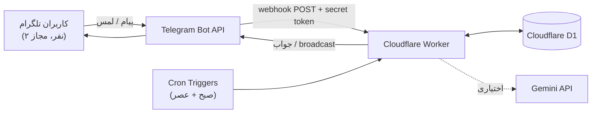

# بات مبینا

**[English](README.md) | فارسی**

یه بات تلگرام سرورلسه که برای دو نفر توی یه رابطه، نقش خاطره‌بان مشترک رو بازی می‌کنه — آرشیوی برای عکس‌ها و لحظه‌ها، یادآوری هوشمند سالگردها، ثبت روزانه‌ی حال‌وهوا، و یه مجموعه بازی دونفره؛ همه‌ش روی زیرساخت edge کلادفلر اجرا می‌شه، بدون نیاز به هیچ سروری.

این پروژه اول یه پروژه‌ی شخصی بود (برای من و دوست‌دخترم ساختمش) و همزمان نمونه‌ای از ساخت یه بات stateful، زمان‌بندی‌شده و پرقابلیت، کاملاً روی زیرساخت سرورلس هم هست.

## قابلیت‌ها

- **آرشیو خاطرات** — ذخیره‌ی عکس (یا یادداشت متنی) همراه با مکان و تاریخ؛ ویرایش یا حذف هر مورد بعداً از طریق منوهای inline راهنما
- **سالگردهای هوشمند** — یادآوری‌های تکرارشونده در ۳۰/۱۴/۷/۳/۱/۰ روز مونده، به‌علاوه یادآوری «این روز در گذشته» برای خاطرات سال‌های قبل
- **ثبت روزانه‌ی حال‌وهوا** — یه چک-این روزانه با انتخاب حال با یه لمس، و خلاصه‌ی هفتگی
- **پیام‌های مخفی** — یه یادداشت برای طرف مقابل بنویس که یا خودکار توی یه تاریخ مشخص تحویل داده بشه، یا توی صندوق پیامش بمونه تا هر وقت خودش خواست بازش کنه
- **یادداشت‌ها و پس‌انداز مشترک** — یه لیست از چیزهای کوچیک که ارزش یادآوری دارن، و یه دفترچه‌ی پس‌انداز مشترک با نوار پیشرفت هدف
- **آمار رابطه و خروجی کامل** — آمار سریع (تعداد خاطرات، روزهای باهم بودن و...) و خروجی کامل با یه لمس، به‌صورت یه آلبوم HTML شیک و قابل‌مشاهده آفلاین
- **ابزارهای عکس** — کلاژ ماهانه و مقایسه‌ی اولین عکس با آخرین عکس
- **قابلیت‌های هوش مصنوعی (اختیاری)** — یه «راوی» که خاطراتتون رو تبدیل به یه داستان کوتاه می‌کنه، پیشنهاد هدیه بر اساس چیزهایی که طرف مقابل گفته، و تشخیص عکس که یه عکس جدید رو با خاطرات قبلی مقایسه می‌کنه (همه از طریق نسخه‌ی رایگان Gemini API؛ بات بدونش هم کامل کار می‌کنه)
- **مجموعه بازی‌ها** — سوال زوجی، جرأت یا حقیقت (دو سطح)، این یا اون، چالش‌های روزانه/هفتگی، هیچ‌وقت این کارو نکردم، سنگ‌کاغذقیچی، دو راست یه دروغ، کوییزی که از روی خاطرات خودتون ساخته می‌شه، به‌علاوه دوز، چهار در ردیف، کشتی‌جنگی، بلک‌جک، دار (حدس کلمه)، زنجیره‌ی کلمات، و یه بازی سرعت واکنش
- **پشتیبانی کامل از تقویم شمسی** — همه‌ی تاریخ‌ها به شمسی (جلالی) نمایش داده می‌شن، با پارس ورودی انعطاف‌پذیر که ارقام فارسی/عربی، جداکننده‌های مختلف، و هر دو ترتیب تاریخ رو قبول می‌کنه
- **قفل‌شده روی دو نفر** — هر درخواست با یه لیست مجاز از آیدی‌های تلگرام چک می‌شه؛ اگه این لیست هیچوقت تنظیم نشه، بات به‌جای باز شدن به روی همه، بسته می‌مونه (fail-closed)

## تکنولوژی‌های استفاده‌شده

- **TypeScript**
- **Cloudflare Workers** — اجرای سرورلس، بدون سرور اصلی
- **Cloudflare D1** — دیتابیس edge سازگار با SQLite
- **Cloudflare Cron Triggers** — جاب‌های زمان‌بندی‌شده (یادآوری‌ها، پرسش حال، چالش‌ها)
- **[grammY](https://grammy.dev)** — فریم‌ورک Telegram Bot API
- **Telegram Bot API** (حالت webhook، با تأیید secret token)
- **Gemini API** — اختیاری، برای قابلیت‌های هوش مصنوعی
- **Vitest** — تست‌های واحد

## معماری

بات به‌صورت یه Cloudflare Worker با دو نقطه‌ی ورودی اجرا می‌شه: یه handler برای `fetch` که وبهوک تلگرام رو دریافت می‌کنه، و یه handler برای `scheduled` که با دو تا Cron Trigger (جاب صبح و عصر) فعال می‌شه. هر دو با همون دیتابیس D1 کار می‌کنن. هیچ پروسه‌ی سرور دائمی و هیچ polling ای وجود نداره — تلگرام آپدیت‌ها رو push می‌کنه، Cloudflare بات رو بیدار می‌کنه، جواب می‌ده، و دوباره می‌خوابه.



## ساختار پروژه

```
cf-worker/
├── src/
│   ├── index.ts       # نقطه‌ی ورودی Worker: handler وبهوک fetch() + handler زمان‌بندی scheduled()
│   ├── bot.ts          # بات grammY: دستورات، منوها، ویزاردها، و بازی‌ها
│   ├── scheduler.ts     # منطق جاب‌های Cron: یادآوری‌ها، پرسش حال، چالش‌های هفتگی/روزانه
│   ├── db.ts           # لایه‌ی کوئری D1 (کل SQL اینجاست، همه parameterized)
│   ├── ai.ts            # کلاینت Gemini API برای قابلیت‌های اختیاری AI
│   ├── gamelogic.ts     # منطق خالص موتور بازی‌ها (دوز، چهار در ردیف و...)
│   ├── content.ts       # متن‌های ثابت (سوالات، چالش‌ها) که توی بازی‌ها استفاده می‌شن
│   ├── dates.ts          # محاسبات تاریخ (شمارش معکوس سالگردها و...)
│   ├── jalali.ts        # تبدیل تقویم میلادی ⇄ شمسی (جلالی)
│   ├── format.ts, keyboards.ts, names.ts, env.ts  # کمک‌کننده‌های کوچیک و تک‌منظوره
├── migrations/          # مایگریشن‌های schema پایگاه‌داده D1، به‌ترتیب اعمال می‌شن
├── test/                # تست‌های واحد Vitest
├── wrangler.jsonc        # تنظیمات Worker (binding ها، زمان‌بندی cron)
└── .dev.vars.example      # قالب سکرت‌های محلی (کپی کن به .dev.vars)
```

## نصب و راه‌اندازی

نیاز به Node.js نسخه ۲۰ به بالا، یه اکانت Cloudflare، و یه توکن بات تلگرام داری (از [@BotFather](https://t.me/BotFather) بسازش).

```bash
git clone https://github.com/Parsairom/mobina-bot.git
cd mobina-bot/cf-worker
npm install
npx wrangler login
```

ساخت دیتابیس D1 و وصل کردنش:

```bash
npx wrangler d1 create mobina-bot-db
```

مقدار `database_id` از خروجی رو توی `wrangler.jsonc` بذار، بعد schema رو اعمال کن:

```bash
npx wrangler d1 migrations apply mobina-bot-db --remote
```

## متغیرهای محیطی

فایل `.dev.vars.example` رو برای توسعه‌ی محلی به `.dev.vars` کپی کن — این فایل gitignore شده، پس مقادیر واقعیت هیچوقت commit نمی‌شن:

```bash
cp .dev.vars.example .dev.vars
```

| متغیر | اجباری | توضیح |
|---|---|---|
| `BOT_TOKEN` | بله | توکن بات تلگرام از @BotFather |
| `TELEGRAM_WEBHOOK_SECRET` | بله | یه رشته‌ی تصادفی که خودت می‌سازی؛ درخواست‌های وبهوک ورودی رو تأیید می‌کنه |
| `ALLOWED_USER_IDS` | بله | آیدی‌های تلگرام مجاز برای استفاده از بات، با کاما جدا (آیدی خودت رو از [@userinfobot](https://t.me/userinfobot) بگیر). **اگه این خالی بمونه، بات همه رو رد می‌کنه.** |
| `USER_NAMES` | خیر | یه نگاشت JSON از آیدی کاربر به اسم نمایشی، مثلاً `{"111111111":"Alice"}` |
| `GEMINI_API_KEY` | خیر | قابلیت‌های هوش مصنوعی رو فعال می‌کنه؛ بدونش هم همه‌چی کار می‌کنه |

برای محیط production، این‌ها رو به‌عنوان **secret** ست کن (نه به‌صورت `vars` ساده توی `wrangler.jsonc`، چون اون فایل commit می‌شه):

```bash
npx wrangler secret put BOT_TOKEN
npx wrangler secret put TELEGRAM_WEBHOOK_SECRET
npx wrangler secret put ALLOWED_USER_IDS
npx wrangler secret put USER_NAMES
# اختیاری:
npx wrangler secret put GEMINI_API_KEY
```

## اجرای بات

**به‌صورت محلی:**

```bash
npm run dev
```

**دیپلوی:**

```bash
npm run deploy
```

بعد تلگرام رو به Worker دیپلوی‌شده‌ت وصل کن (هر دو placeholder رو جایگزین کن — secret باید دقیقاً همون چیزی باشه که برای `TELEGRAM_WEBHOOK_SECRET` ست کردی):

```
https://api.telegram.org/bot<BOT_TOKEN>/setWebhook?url=https://<your-worker>.workers.dev/webhook&secret_token=<TELEGRAM_WEBHOOK_SECRET>
```

جواب موفق این‌شکلیه: `{"ok":true,"result":true,"description":"Webhook was set"}`.

## تست‌ها

```bash
npm run test        # تست‌های واحد (محاسبات تاریخ، تبدیل تقویم جلالی، منطق بازی‌ها)
npm run typecheck    # تایپ‌اسکریپت strict، شامل تشخیص کد بلااستفاده
```

## امنیت

- همه‌ی secret ها (توکن بات، وبهوک سکرت، آیدی‌های مجاز، اسم‌ها، کلید AI) به‌صورت **secret** کلادفلر ذخیره می‌شن، هیچوقت توی ریپو commit نمی‌شن.
- endpoint مربوط به `/webhook` هر درخواستی که هدر `X-Telegram-Bot-Api-Secret-Token` درست رو نداشته باشه رد می‌کنه.
- دسترسی محدود به یه لیست صریح از آیدی‌های تلگرامه؛ اگه این لیست اشتباه تنظیم بشه یا خالی باشه، بات **fail-closed** می‌شه (همه رو رد می‌کنه) نه اینکه باز بشه.
- همه‌ی کوئری‌های دیتابیس parameterized هستن (بدون ساختن SQL با string).
- یه مشکل امنیتی پیدا کردی؟ لطفاً به‌جای issue عمومی، یه security advisory خصوصی توی گیت‌هاب باز کن.

## بهبودهای آینده

- تقسیم `bot.ts` (که الان یه فایل بزرگ شامل همه‌ی قابلیت‌هاست) به ماژول‌های جدا به ازای هر قابلیت، چون داره بزرگ‌تر می‌شه
- اضافه کردن تست‌های integration که مستقیم لایه‌ی D1 رو تست کنن (مثلاً با `@cloudflare/vitest-pool-workers`)، علاوه بر تست‌های واحد فعلی
- پشتیبانی دوزبانه (فارسی/انگلیسی) برای پاسخ‌های بات

## مجوز

MIT — به فایل [LICENSE](LICENSE) نگاه کن.
