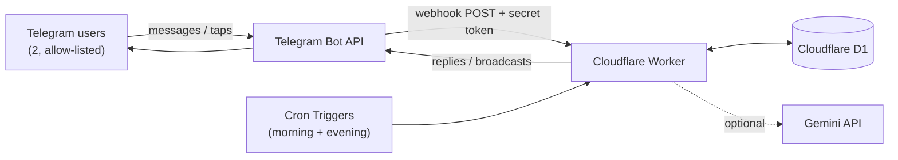

# Mobina Bot

**English | [فارسی](README.fa.md)**

A serverless Telegram bot that acts as a shared memory keeper for two people in a relationship — an archive for photos and moments, smart anniversary reminders, a daily mood tracker, and a small hub of two-player games, all running on Cloudflare's edge with no server to maintain.

It started as a personal project (built for my partner and me) and doubles as a demonstration of building a stateful, scheduled, multi-feature bot entirely on serverless infrastructure.

## Features

- **Memory archive** — save photos (or text-only notes) with a location and date; edit or delete any entry later through guided inline menus
- **Smart anniversaries** — recurring reminders at 30/14/7/3/1/0 days out, plus an on-this-day flashback for memories from previous years
- **Daily mood tracker** — a daily check-in with a one-tap mood picker and a weekly summary
- **Secret messages** — write a note for your partner that delivers automatically on a chosen date, or sits in their inbox to open whenever they want
- **Shared notes & savings tracker** — a running list of small things worth remembering, and a shared savings log with a goal progress bar
- **Relationship stats & full export** — quick stats (memory count, days together, etc.) and a one-tap export of everything to a styled, offline-readable HTML album
- **Photo tools** — a monthly collage and a first-photo-vs-latest-photo comparison
- **AI features (optional)** — a relationship "narrator" that turns your memories into a short story, gift suggestions based on things your partner has said, and photo recognition that matches a new photo against past memories (all via the Gemini API's free tier; the bot works fully without it)
- **Games hub** — couple's questions, truth-or-dare (two spice levels), this-or-that, daily/weekly challenges, never-have-I-ever, rock-paper-scissors, two-truths-and-a-lie, a quiz generated from your own memories, plus tic-tac-toe, connect four, battleship, blackjack, hangman, word chain, and a reaction-speed game
- **Persian calendar support** — every date is shown in Shamsi (Jalali), with lenient input parsing that accepts Persian/Arabic-Indic digits, multiple separators, and either date order
- **Locked down to two people** — every request is checked against an allow-list of Telegram user IDs; if that list is ever unset, the bot fails *closed* (denies everyone) rather than opening up

## Tech Stack

- **TypeScript**
- **Cloudflare Workers** — serverless compute, no origin server
- **Cloudflare D1** — SQLite-compatible edge database
- **Cloudflare Cron Triggers** — scheduled jobs (reminders, mood prompts, challenges)
- **[grammY](https://grammy.dev)** — Telegram Bot API framework
- **Telegram Bot API** (webhook mode, secret-token verified)
- **Gemini API** — optional, for the AI-powered features
- **Vitest** — unit tests

## Architecture

The bot runs as a single Cloudflare Worker with two entry points: an HTTP `fetch` handler that receives Telegram's webhook, and a `scheduled` handler fired by two Cron Triggers (morning and evening jobs). Both talk to the same D1 database. There's no persistent server process and no polling — Telegram pushes updates in, Cloudflare wakes the Worker up, it responds, and it goes back to sleep.



## Project Structure

```
cf-worker/
├── src/
│   ├── index.ts       # Worker entry point: fetch() webhook handler + scheduled() cron handler
│   ├── bot.ts          # grammY bot: commands, menus, wizards, and game handlers
│   ├── scheduler.ts     # Cron job logic: reminders, mood prompts, weekly/daily challenges
│   ├── db.ts           # D1 query layer (all SQL lives here, fully parameterized)
│   ├── ai.ts            # Gemini API client for the optional AI features
│   ├── gamelogic.ts     # Pure game-engine logic (tic-tac-toe, connect four, etc.)
│   ├── content.ts       # Static prompts/questions/challenges used by the games
│   ├── dates.ts          # Date arithmetic (anniversary countdowns, etc.)
│   ├── jalali.ts        # Gregorian ⇄ Persian (Jalali) calendar conversion
│   ├── format.ts, keyboards.ts, names.ts, env.ts  # small focused helpers
├── migrations/          # D1 schema migrations, applied in order
├── test/                # Vitest unit tests
├── wrangler.jsonc        # Worker configuration (bindings, cron schedule)
└── .dev.vars.example      # Template for local secrets (copy to .dev.vars)
```

## Setup

Requires Node.js 20+, a Cloudflare account, and a Telegram bot token (create one via [@BotFather](https://t.me/BotFather)).

```bash
git clone https://github.com/Parsairom/mobina-bot.git
cd mobina-bot/cf-worker
npm install
npx wrangler login
```

Create the D1 database and wire it up:

```bash
npx wrangler d1 create mobina-bot-db
```

Copy the `database_id` from the output into `wrangler.jsonc`, then apply the schema:

```bash
npx wrangler d1 migrations apply mobina-bot-db --remote
```

## Environment Variables

Copy `.dev.vars.example` to `.dev.vars` for local development — it's git-ignored, so your real values never get committed:

```bash
cp .dev.vars.example .dev.vars
```

| Variable | Required | Description |
|---|---|---|
| `BOT_TOKEN` | Yes | Telegram bot token from @BotFather |
| `TELEGRAM_WEBHOOK_SECRET` | Yes | Random string you generate; verifies incoming webhook requests |
| `ALLOWED_USER_IDS` | Yes | Comma-separated Telegram user IDs allowed to use the bot (get yours from [@userinfobot](https://t.me/userinfobot)). **Bot denies everyone if this is unset.** |
| `USER_NAMES` | No | JSON map of user ID → display name, e.g. `{"111111111":"Alice"}` |
| `GEMINI_API_KEY` | No | Enables the AI-powered features; everything else works without it |

For production, set these as **secrets** (never as plain `vars` in `wrangler.jsonc`, since that file is committed):

```bash
npx wrangler secret put BOT_TOKEN
npx wrangler secret put TELEGRAM_WEBHOOK_SECRET
npx wrangler secret put ALLOWED_USER_IDS
npx wrangler secret put USER_NAMES
# optional:
npx wrangler secret put GEMINI_API_KEY
```

## Running the Bot

**Locally:**

```bash
npm run dev
```

**Deploy:**

```bash
npm run deploy
```

Then point Telegram at your deployed Worker (replace both placeholders — the secret must match what you set for `TELEGRAM_WEBHOOK_SECRET`):

```
https://api.telegram.org/bot<BOT_TOKEN>/setWebhook?url=https://<your-worker>.workers.dev/webhook&secret_token=<TELEGRAM_WEBHOOK_SECRET>
```

A successful response looks like `{"ok":true,"result":true,"description":"Webhook was set"}`.

## Testing

```bash
npm run test        # unit tests (date math, Jalali calendar conversion, game logic)
npm run typecheck    # strict TypeScript, including unused-code detection
```

## Security

- All secrets (bot token, webhook secret, allowed user IDs, names, AI key) are Cloudflare **secrets**, never committed to the repo.
- The `/webhook` endpoint rejects any request that doesn't carry the correct `X-Telegram-Bot-Api-Secret-Token` header.
- Access is restricted to an explicit allow-list of Telegram user IDs; if that list is misconfigured or empty, the bot **fails closed** (denies everyone) instead of opening up.
- All database queries are parameterized (no string-built SQL).
- Found a security issue? Please open a private security advisory on GitHub rather than a public issue.

## Future Improvements

- Split `bot.ts` (currently one large file covering every feature) into per-feature modules as it keeps growing
- Add integration tests that exercise the D1 layer directly (e.g. with `@cloudflare/vitest-pool-workers`), on top of the current unit tests
- Bilingual (Persian/English) support for the bot's replies

## License

MIT — see [LICENSE](LICENSE).
